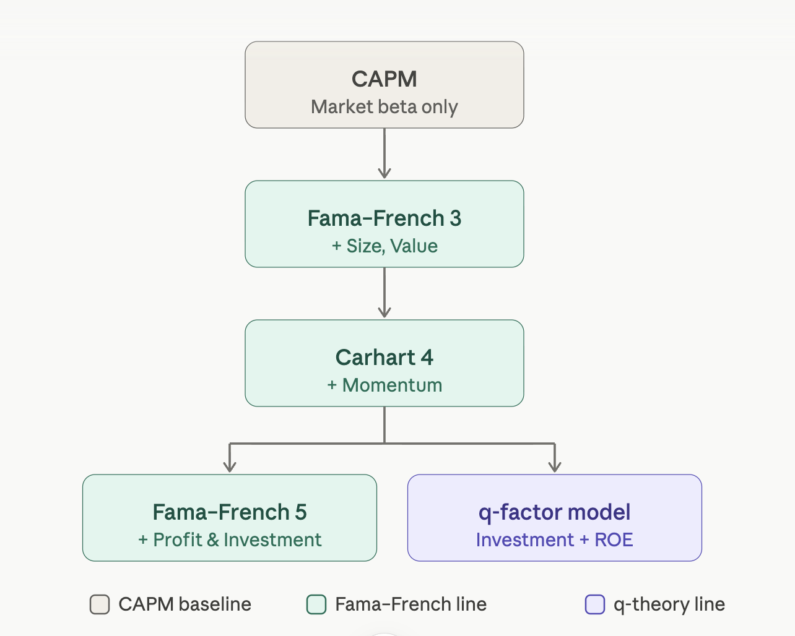
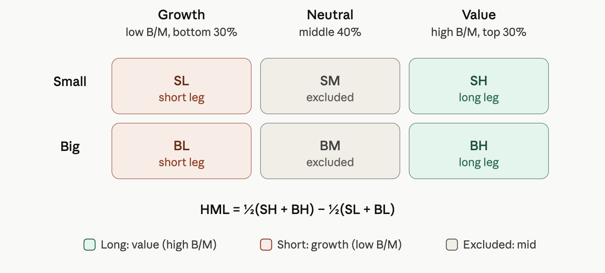
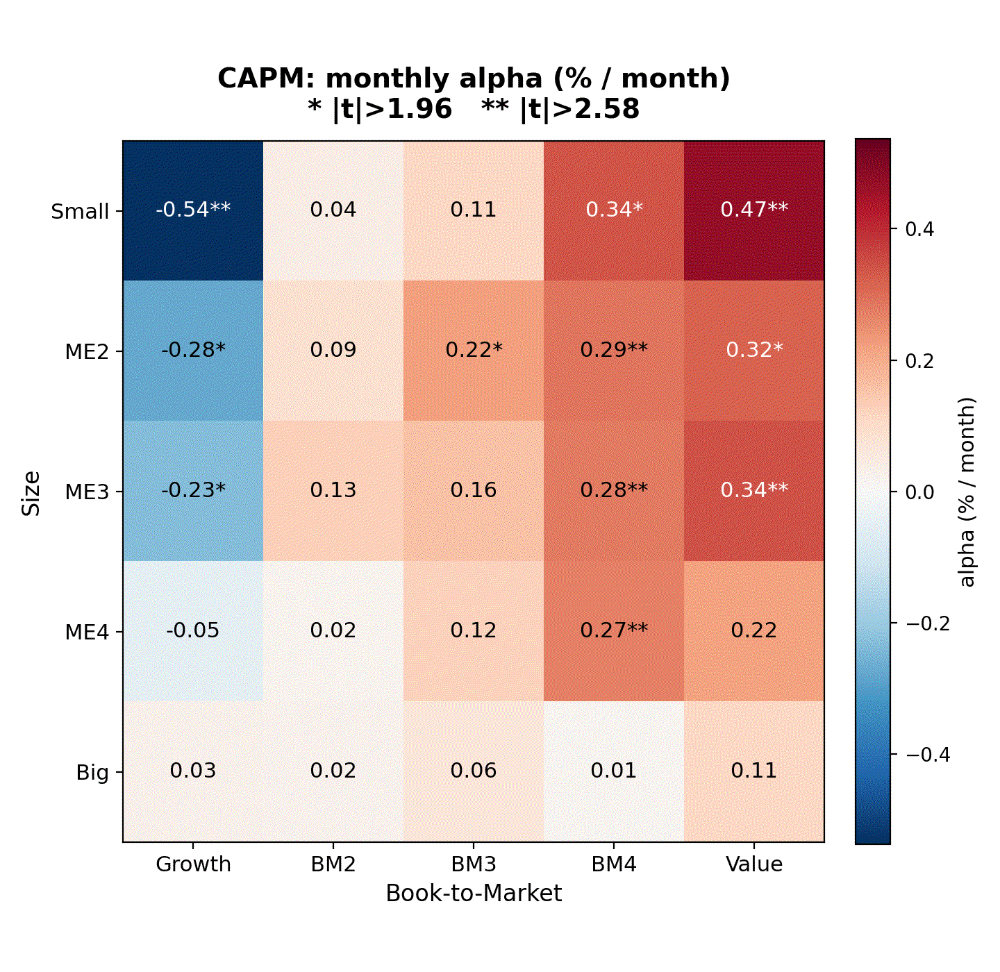
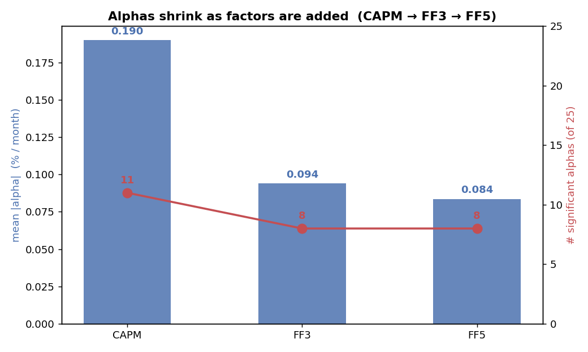

# Factor Models: What Clicked When I Built Them from Scratch

I started reading papers on asset pricing models to get an overview of how the models evolved. Factor investing is one of the most well-documented ideas in finance. The equations are clean in theory, but many questions arise once you start implementing them yourself. How is a factor exactly calculated? If both sides of the regression are returns, what does the regression actually mean? And if this all describes the past, what practical use does it have for future investment decisions? 
If you're interested in implementation details, here is the code and a short article answering the questions I faced!

## The overview

Asset pricing models started with CAPM, which states that the excess return of an asset is explained by beta — how sensitive it is to movements in the market. Later, Fama and French suggested adding two more factors, size and value, which captured effects that beta alone missed. Then momentum was added: stocks that outperformed recently tend to continue doing so, and vice versa. Today there are two competing frameworks: Fama–French 5 and the q-factor model, where investment and profitability are included with different proxies.

This overview you can find easily everywhere. I try to answer some questions — mostly at the implementation level — which I faced rather than repeating the same story. The highlights are the questions.

It starts with one factor and other models add new ones. It's important to read every premium through the lenses of _risk-based rationale_ and _behavioral reason_. **A number in a backtest is not a factor until you can say _why the premium should exist_.**

For each factor, hold both stories at once:

- **Risk-based / rational** — the characteristic proxies undiversifiable systematic risk; the premium is fair compensation. If true, it _survives_ being known, because you're paid for bearing risk.
- **Behavioral** — there is a systematic mistake in investor behavior which creates a gap to profit from. But it keeps repeating, because the biases that cause it are structural (overextrapolation, leverage constraints, lottery-seeking).

## CAPM

Sharpe in 1964 said the excess return of the asset is explained by beta — an indicator of how it varies with market changes.

$$R^i_t - R_f = \alpha^i + \beta^i_{Mkt}(Mkt\text{-}RF)_t + \varepsilon^i_t$$

## Fama–French 3

Then Fama and French added two more factors: size and value. These two factors explained a lot more of the excess return of portfolios which were not explained by $\beta$ alone. They extended the model to:

$$R^i_t - R_f = \alpha^i + \beta^i_{Mkt}(Mkt\text{-}RF)_t + \beta^i_{SMB} \, SMB_t + \beta^i_{HML} \, HML_t + \varepsilon^i_t$$

### What does each new factor capture?

**Size (SMB = small minus big).** The proxy is market capitalization. Small firms earn higher returns than large firms, on average. The risk story: small firms are harder to trade, more vulnerable to downturns, and more likely to go bankrupt — you're compensated for bearing that illiquidity and distress risk. The behavioral story: analysts cover fewer small stocks, so mispricings persist longer. Caveat: this is the weakest and most contested premium, thin to absent in US large-cap data since the early 1980s.

**Value (HML = high minus low book-to-market).** The proxy is book-to-market ratio: book equity ÷ market cap. Firms with higher book-to-market — cheap relative to their fundamentals — tend to outperform expensive ones. The risk story: cheap stocks are cheap for a reason (declining earnings, high leverage, cyclical industries), and the premium compensates for that pain. The behavioral story: investors overextrapolate — they see recent bad performance and assume it continues forever, pushing the price too low. A tension: after controlling for profitability and investment in FF5, value loses much of its explanatory power in US data. Is it a real standalone factor or a noisy proxy for quality? This is unresolved.

## What is the data?

Fama–French data is available from the [Ken French Data Library](https://mba.tuck.dartmouth.edu/pages/faculty/ken.french/data_library.html). The test assets are 25 portfolios formed by a 5×5 independent sort on size and book-to-market. $R_m - R_f$ is the excess return on the market: the value-weighted return of all CRSP firms incorporated in the US and listed on the NYSE, AMEX, or NASDAQ (common stocks only), minus the one-month Treasury bill rate.

The 25 test portfolios partition a _subset_ of the market universe, not the whole thing — a stock needs valid accounting data (from Compustat) to be sorted into a cell, while the market return only requires valid price data (from CRSP).

## How are the factors calculated?

The key mental model: **each factor is a zero-cost long–short return** — go long the favored bucket, short the other — which is why only the _test portfolios_, not the factors, need $R_f$ subtracted.

All factors come from **sorting stocks into portfolios, value-weighting the returns within each, and taking long-minus-short differences.**

The breakpoints are set once a year, at end of June:

- **Size:** split all stocks at the **NYSE median** market cap → Small (S) / Big (B).
- **Other variable** (B/M, profitability, investment): split at the **NYSE 30th and 70th percentiles** → Low / Neutral / High (3 buckets).

That gives a **2×3 sort** = 6 value-weighted portfolios, rebalanced each June using the prior fiscal year's accounting data.

An important detail: the factors are built from a **2×3 sort** and the test portfolios from a **5×5 sort**. These are different slicings of the same universe of stocks. The factors and the test portfolios are constructed independently — this separation is what makes the regression test non-circular.

## What does a regression of return on return mean?

Each beta (coefficient) shows how much of the portfolio's return can be attributed to a zero-cost long–short position based on some characteristic.

What's alpha? It shows the unexplained return. It can be because of skill in choosing that portfolio, or because of factors which are not yet included in our model.

So by adding more factors (with significant coefficients), we explain a greater portion of the return. This implies that adding more valid factors should result in alpha shrinking.

## Fama–French 5

In the FF5 model we add two more factors: investment and profitability.

$$R^i_t - R_f = \alpha^i + \beta^i_{Mkt}(Mkt\text{-}RF)_t + \beta^i_{SMB} \, SMB_t + \beta^i_{HML} \, HML_t + \beta^i_{RMW} \, RMW_t + \beta^i_{CMA} \, CMA_t + \varepsilon^i_t$$

**High Profitability (RMW = robust minus weak).** Firms with high operating profitability earn higher subsequent returns than unprofitable firms. The proxy is gross profit ÷ total assets (Novy-Marx) or operating profitability (Fama–French). This almost follows from accounting: two firms with the same price but different profitability — the profitable one is effectively _cheaper_ relative to the cash flows it generates. Profitability is a refined, forward-looking version of value. This is also why it partly subsumes HML in FF5: a high-B/M stock that is _also_ highly profitable is cheap and good; a high-B/M stock with low profitability is a value trap.

**Low Investment (CMA = conservative minus aggressive).** Firms that grow their asset base conservatively outperform those that invest aggressively. The proxy is year-over-year change in total assets. The q-theory story: a firm investing heavily is signaling that its cost of capital is _low_ — it's accepting projects with lower hurdle rates. A firm that barely invests signals a _high_ hurdle rate, which means higher expected stock returns. Investment _reveals_ expected returns. The behavioral story: empire-building managers over-invest in value-destroying projects; the market eventually punishes them.

## Watching alpha shrink

You can see the alpha shrinking as factors are added:

Under CAPM, 11 of 25 portfolios show statistically significant alphas. Adding size and value (FF3) absorbs most of that. Adding profitability and investment (FF5) pushes the remaining alphas closer to zero. The "anomalies" under CAPM weren't mispricing — they were unmodeled factor exposure.

## If the regression is past return on past return, what practical use does it have?

**Separating skill from exposure.** If a fund's return is fully explained by its factor loadings, there is no alpha — you're paying active fees for exposure you could get from cheap factor ETFs.

**Estimating expected returns.** If you believe a factor premium will persist, you can build a forward view:

$$E[R^i] = R_f + \beta^i_{Mkt} \, E[Mkt\text{-}RF] + \beta^i_{SMB} \, E[SMB] + \beta^i_{HML} \, E[HML] + \dots$$

The regression gives you the loadings; the investment thesis gives you the assumed premia.

**Knowing what you actually own.** Two funds that look different on the surface can turn out to be the same factor bet. Factor decomposition reveals unintended concentration, lets you hedge exposures you don't want, and helps you size positions by their true risk contribution.

**Deliberate factor investing.** Once you accept that certain characteristics carry persistent premia — and can articulate _why_ — you can tilt toward them systematically. This is the foundation of smart beta.

_Code and full regression output: [github.com/ParimahSafarian/factor-lab](https://github.com/ParimahSafarian/factor-lab)_
